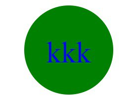
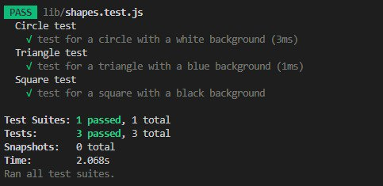

# SVGLogoMaker

## Description

To build a Node.js command-line application that takes in user input to generate a logo and save it as an SVG fileLinks to an external site.. The application prompts the user to select a color and shape, provide text for the logo, and save the generated SVG to a .svg file.

## Table of Contents

- [Installation](#Installation)
- [Usage](#Usage)
- [Example](#Example)
- [Full Walkthrough Video](#full-walkthrough-video)
- [Contributors](#Contributors)
- [Tests](#Tests)
- [Questions](#Questions)

## Installation

```
npm install
```

## Usage

```md
AS a freelance web developer
I WANT to generate a simple logo for my projects
SO THAT I don't have to pay a graphic designer
GIVEN a command-line application that accepts user input
WHEN I am prompted for text
THEN I can enter up to three characters
WHEN I am prompted for the text color
THEN I can enter a color keyword (OR a hexadecimal number)
WHEN I am prompted for a shape
THEN I am presented with a list of shapes to choose from: circle, triangle, and square
WHEN I am prompted for the shape's color
THEN I can enter a color keyword (OR a hexadecimal number)
WHEN I have entered input for all the prompts
THEN an SVG file is created named `logo.svg`
AND the output text "Generated logo.svg" is printed in the command line
WHEN I open the `logo.svg` file in a browser
THEN I am shown a 300x200 pixel image that matches the criteria I entered
```

## Example





## Full Walkthrough Video
[Link](https://drive.google.com/file/d/1MVBnvAmlWNojCc8earvXZnlirJTps7Hg/view)


## Contributors

Kenny

## Tests

```
npm run test
```



## Questions

For additional questions, contact me at the email provided below.

- GitHub: [SVGLogoMaker](https://github.com/KennyZhang12138/SVGLogoMaker/tree/main)
